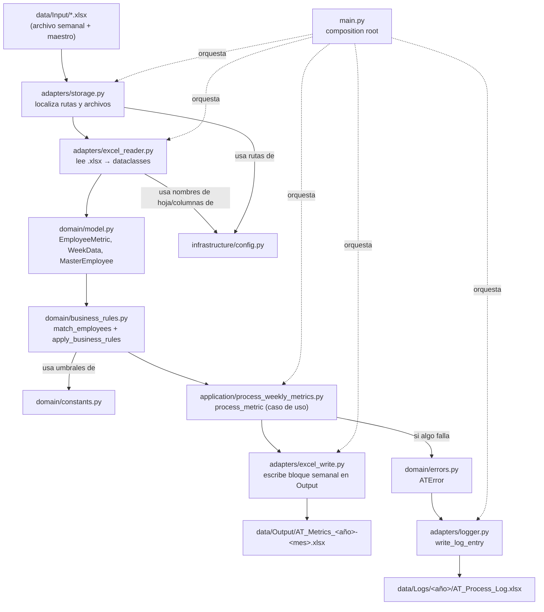

# Metricas — Automatización de reportes semanales de horas (AT)

> Documentación técnico-pedagógica. Objetivo: que puedas reconstruir este proyecto desde cero,
> entendiendo **por qué** cada pieza existe y en qué orden lógico depende de las anteriores —
> no solo qué hace cada archivo.

## Qué hace el proyecto

Cada semana, alguien exporta un reporte de horas productivas/pasivas por empleado a un archivo
`.xlsx` (columnas: horas activas, horas pasivas, meta, horas/día, comentarios...). El proyecto:

1. Lee ese Excel semanal y el Excel maestro de empleados (`AT_Employees.xlsx`).
2. Cruza ambos por nombre (solo procesa empleados que existen en el maestro).
3. Aplica reglas de negocio: ¿el empleado cumplió el umbral de horas productivas por día? ¿se
   pasó del umbral de horas pasivas? → pinta la celda de verde o rojo.
4. Escribe (o acumula, semana tras semana) un Excel de salida consolidado, con un log de cada
   ejecución.

Tiene **dos modos de origen/destino de archivos**, pensados como capas intercambiables:

- **Modo local**: lee y escribe archivos en `data/` del disco local. **Es el único modo
  completo y funcional hoy.**
- **Modo Graph API (SharePoint)**: el mismo flujo, pero leyendo/escribiendo en una biblioteca de
  SharePoint vía Microsoft Graph API, autenticando por OAuth. **Existe como código aislado
  (adapters), pero todavía no está conectado al flujo real** — ver la sección dedicada más abajo.

---

## Diagrama de flujo (modo local, que es el que hoy corre de punta a punta)



**Arquitectura hexagonal**: las flechas de dependencia de código (no de datos) solo apuntan
*hacia adentro*. `domain/` no importa nada de `adapters/` ni `infrastructure/`; `adapters/` sí
puede importar de `domain/` e `infrastructure/`. Esto es lo que permite que el modo Graph API
(sección final) pueda existir como un adapter alternativo sin tocar una sola línea de
`domain/`.

---

## 1. `domain/model.py` — la forma de los datos

### Propósito
Antes de escribir cualquier lógica, hacía falta decidir **qué forma tienen los datos** que
viajan por todo el sistema. Este archivo no tiene comportamiento, solo estructura: son los
moldes (`dataclass`, una clase de Python que genera automáticamente `__init__`, `__repr__` y
comparación por valor a partir de anotaciones de tipo) que usa todo lo demás.

### Dependencias
Ninguna del proyecto. Solo `dataclasses` y `datetime` de la librería estándar. Es intencional:
es la pieza más interna de la arquitectura hexagonal, el "círculo cero".

### Componentes clave

```python
@dataclass
class EmployeeMetric:
    name: str                          # nombre tal como viene del Excel (sin normalizar)
    department: str
    productive_active_hours: float
    productive_passive_hours: float
    total_hours: float
    active_days: int
    goal: float                        # meta de horas (viene del propio Excel semanal)
    hours_per_day: float                # horas productivas / días activos — usado para el semáforo
    comments: str
    color_hours_day: str = ""          # "green" | "red" | "none" — lo llena business_rules.py
    color_passive: str = ""            # idem, para horas pasivas
    source_file: str = ""              # nombre del archivo de origen, para trazabilidad en logs
```
`color_hours_day` y `color_passive` empiezan vacíos porque **no se calculan al leer el Excel**;
se calculan después, en `domain/business_rules.py`. Separar "leer" de "calcular" es la razón por
la que existen como campos mutables con default `""` en vez de ser parte del constructor
obligatorio.

```python
@dataclass
class WeekData:
    week_start: date
    week_end: date
    year: int
    employees: list[EmployeeMetric]
```
Representa **una corrida completa**: el rango de semana (leído de una celda de texto tipo
`"Week: 05/29/2025 - 06/03/2025"`) y la lista de empleados de esa semana. Es lo que retorna
`excel_reader.read_weekly_excel()` y lo que consume `excel_write.py` para escribir el bloque.

```python
@dataclass
class LogEntry:
    source_file: str
    execution_date: datetime
    status: str          # "SUCCESS" | "ERROR" | "PENDING" (ver domain/errors.py y main.py)
    error_message: str
    error_code: str
```
Es la fila que termina escrita en el Excel de log. `main.py` es quien la construye (dentro del
`except ATError`), y `adapters/logger.py` es quien la persiste.

```python
@dataclass
class MasterEmployee:
    employee_id: str
    name: str
    email: str
    status: str
```
Representa una fila del Excel maestro de empleados (`AT_Employees.xlsx`). Su único uso hoy es
`name`, dentro de `business_rules.match_employees()` — ahí se decide qué empleados del reporte
semanal son "reales" (existen en el maestro) y cuáles se descartan.

### Flujo de datos
`excel_reader.py` lee bytes de un `.xlsx` y los transforma en instancias de estas dataclasses.
De ahí en adelante, **ningún otro módulo vuelve a tocar un archivo Excel crudo**: todos trabajan
sobre estos objetos Python tipados. Es el punto de conversión "mundo exterior desordenado" →
"mundo interno tipado".

### Por qué se diseñó así
Usar `dataclass` en vez de diccionarios (`dict`) da autocompletado, chequeo de tipos estático
(con `mypy` o el propio editor) y errores inmediatos si falta un campo — un `dict` con una llave
mal escrita falla en silencio o revienta en producción con un `KeyError` lejos de donde se
originó el problema. Separar estos objetos en `domain/` (y no, por ejemplo, definirlos dentro de
`excel_reader.py`) permite que **cualquier adapter** (Excel, Graph API, un CSV futuro) construya
los mismos objetos — el resto del sistema no sabe ni le importa de dónde vinieron.

---

## 2. `domain/constants.py` — números que son decisiones de negocio

### Propósito
Separar los números que representan **reglas del negocio** (¿cuántas horas son "suficientes"?)
de los que son **detalles técnicos** (¿en qué fila empieza la tabla en el Excel?). Este archivo
solo tiene los primeros.

### Dependencias
Ninguna. Es una hoja de constantes puras.

### Componentes clave
```python
GOALS = {"daily": 7.5, "weekly": 37.5, "monthly": 150}
DEPARTMENT = "7000 - INFORMATION TECHNOLOGY"
HOURS_PER_DAY_THRESHOLD = 6.75   # >= esto → verde en business_rules.calculate_productive_color
PASSIVE_HOURS_THRESHOLD = 1.25   # >= esto → rojo en business_rules.calculate_passive_status
```

### Flujo de datos
Estas constantes entran directamente a `domain/business_rules.py` (import directo) y a
`build_placeholder_employees()` (para rellenar `goal` y `department` en las semanas
"placeholder" que se generan al detectar un cruce de mes — ver sección 5).

### Por qué se diseñó así
Originalmente todo esto vivía junto con las rutas de carpetas y el nombre de la hoja de Excel en
un único `config.py`. El problema: `business_rules.py` (que es el círculo más interno del
dominio) necesitaba estos umbrales, y si `config.py` completo se movía a `infrastructure/` (el
círculo más externo), el dominio terminaría dependiendo de infraestructura — la violación más
básica posible de arquitectura hexagonal (las flechas de dependencia solo pueden apuntar hacia
adentro). La solución fue partir `config.py` en dos archivos sin tocar ni un valor: lo que es
regla de negocio se quedó en `domain/constants.py`; lo que es detalle técnico se movió a
`infrastructure/config.py`. Resultado: `domain/business_rules.py` importa de `domain/constants.py`
(dominio importando de dominio, válido) en vez de importar de infraestructura.

---

## 3. `domain/errors.py` — un formato único para cualquier cosa que salga mal

### Propósito
Sin esto, cada módulo inventaría su propia forma de fallar (`raise ValueError(...)` aquí,
`raise FileNotFoundError(...)` allá, `return None` en otro lado) y quien consuma el error
tendría que adivinar qué pasó. Este archivo estandariza: **todo error de negocio o de
infraestructura conocido se reporta con un código fijo, un mensaje fijo y un detalle
específico.**

### Dependencias
Ninguna del proyecto — es la base sobre la que todo lo demás construye su manejo de errores.

### Componentes clave
```python
ERROR_MESSAGES = {
    "ERR001": "The folder does not exist",
    "ERR002": "There are no Excel files to process",
    "ERR004": "Could not open the Excel file",
    "ERR005": "The expected sheet does not exist",
    "ERR006": "Excel file columns do not match the expected structure",
    "ERR010": "Invalid week format",
    "ERR011": "Inconsistent year",
    "ERR012": "Invalid date format",
    "ERR013": "The weekly file crosses two months and requires manual processing",
    "ERR014": "Could not save the Excel file",
    "ERR015": "Cross-month templates already exist",
    "ERR020": "Could not authenticate with Graph",
    "ERR021": "Could not list files from SharePoint",
    "ERR022": "Could not download file from SharePoint",
}

class ATError(Exception):
    def __init__(self, code, detail):
        self.code = code
        self.message = ERROR_MESSAGES.get(code, "Unknown error")
        self.detail = detail
        super().__init__(self.message)
```
- `code`: string corto (`"ERR004"`) — es lo que `main.py` usa para decidir el `status` del log
  (`ERR015` → `"SUCCESS"`, `ERR013` → `"PENDING"`, cualquier otro → `"ERROR"`).
- `detail`: string libre con el contexto específico (ej. nombre del archivo que falló). Es lo
  que distingue dos errores del mismo código entre sí.
- `message`: se resuelve automáticamente desde `ERROR_MESSAGES` — si alguien pasa un código no
  registrado, cae en `"Unknown error"` en vez de reventar.

Nota: hay un `ERR023` usado en `sharepoint_client.py` (upload) que **no está en este diccionario
todavía** — ver "Problemas conocidos" en la sección de Graph API.

### Flujo de datos
Cualquier adapter (`excel_reader.py`, `excel_write.py`, `storage.py`, `sharepoint_client.py`)
que detecta una condición anómala hace `raise ATError("ERRxxx", "detalle")`. Ese error sube por
la pila de llamadas hasta `main.py`, que lo captura en un único `except ATError` y lo convierte
en un `LogEntry`.

### Por qué se diseñó así
Es el patrón "excepción tipada de dominio" en vez de dejar que se propaguen excepciones nativas
de Python (`KeyError`, `FileNotFoundError`) hasta el usuario final. La ventaja concreta: **un
único `except ATError` en `main.py`** puede manejar *cualquier* falla del sistema, sin un
`except` distinto por cada tipo de error posible. El costo es disciplina: cada adapter tiene que
acordarse de atrapar la excepción nativa y relanzarla como `ATError` (se ve, por ejemplo, en
`excel_reader.read_excel`, que atrapa el `Exception` genérico de `openpyxl.load_workbook` y lo
convierte en `ATError("ERR004", ...)`).

---

## 4. `infrastructure/config.py` — el detalle técnico que puede cambiar sin tocar el negocio

### Propósito
Todo lo que depende de "cómo está armado el Excel *hoy*" (nombre de hoja, en qué fila empiezan
los datos, qué columnas se esperan, qué color hex pintar) vive aquí, separado de las reglas de
negocio. Si mañana cambia el nombre de la hoja de Excel, se toca un solo archivo técnico y las
reglas de negocio (`domain/`) ni se enteran.

### Dependencias
Solo `pathlib.Path` de la librería estándar.

### Componentes clave
```python
PROJECT_ROOT = Path(__file__).parent.parent
PATHS = {
    "input": PROJECT_ROOT / "data" / "Input",
    "output": PROJECT_ROOT / "data" / "Output",
    "logs": PROJECT_ROOT / "data" / "Logs",
    "parametric": PROJECT_ROOT / "data" / "Parametric_Files",
}
```
`PROJECT_ROOT` sube dos niveles desde `infrastructure/config.py` (que vive un nivel de
profundidad respecto a la raíz del proyecto) y aterriza en `Metricas/`, donde vive `data/`.

Otras constantes relevantes: `WEEKLY_COLUMNS` / `MASTER_COLUMNS` / `OUTPUT_COLUMNS` (listas de
nombres de columna exactos, usadas para *validar* que el Excel de entrada tiene la forma
esperada — ver sección 6), `SHEET_NAME` / `SHEET_MASTER` / `OUTPUT_SHEET_NAME` (nombres de hoja),
`HEADER_ROW` / `START_ROW` / `WEEK_ROW` (filas fijas donde `openpyxl` debe empezar a leer),
`COLORS` (los hex `"63BE7B"` verde / `"F8696B"` rojo que se pintan en las celdas) y
`COLUMN_WIDTHS` (ancho de columna del Excel de salida, puramente estético).

### Flujo de datos
Es importado por casi todos los `adapters/` (`excel_reader.py`, `excel_write.py`, `storage.py`,
`logger.py`) — nunca por `domain/`. Cada adapter toma de aquí solo las constantes que necesita
para su tarea específica.

### Por qué se diseñó así
Es el mismo razonamiento que en `domain/constants.py`, visto desde el otro lado: si estas
constantes vivieran mezcladas con `GOALS` o `HOURS_PER_DAY_THRESHOLD`, cualquier módulo de
dominio que importara "config" arrastraría también detalles de Excel que no le corresponden. La
separación permite además el mismo truco que habilita el modo Graph API: **el nombre de hoja y
las columnas esperadas son los mismos sin importar si el archivo viene de disco o de
SharePoint** — es contenido del Excel, no de su transporte. Por eso `infrastructure/config.py`
no tiene ninguna constante específica de Graph (esas viven implícitas como parámetros de función
en `sharepoint_client.py`, ver sección final).

---

## 5. `adapters/storage.py` — el encargado de bodega (modo local)

### Propósito
Antes de poder leer un Excel hay que saber **dónde está**. Este archivo es la única pieza del
sistema que sabe de rutas de carpetas en disco: no sabe interpretar el contenido de un Excel,
solo sabe encontrarlo, validarlo como presente/ausente y calcular dónde debe escribirse la
salida.

### Dependencias
`domain/errors.py` (para fallar con `ATError` en vez de dejar que reviente un
`FileNotFoundError` crudo) e `infrastructure/config.py` (para las rutas base en `PATHS`).

### Componentes clave

| Función | Parámetros | Retorna | Para qué |
|---|---|---|---|
| `list_input_files()` | — | `list[Path]` | Todos los `.xlsx` en `data/Input/`. Lanza `ATError("ERR001")` si la carpeta no existe, `ATError("ERR002")` si está vacía. |
| `get_employees_path()` | — | `Path` | Ruta fija al Excel maestro: `data/Parametric_Files/AT_Employees.xlsx`. |
| `get_output_path(year, month)` | `int, int` | `Path` | Ruta al Excel de salida del mes, creando la carpeta si no existe (`mkdir(parents=True, exist_ok=True)`). Consumida por `main.py` y `process_weekly_metrics.py`. |
| `get_next_month_output_path(year, month)` | `int, int` | `Path` | Igual que la anterior pero para el mes siguiente (con rollover de diciembre a enero) — usada solo en el manejo de semanas que cruzan de mes. |
| `get_log_path(year)` | `int` | `Path` | Ruta al Excel de log anual, creando la carpeta si hace falta. |
| `output_exists(file_path)` | `Path` | `bool` | Simplemente `file_path.exists()` — decide si `main.py` debe crear un workbook nuevo o cargar uno existente. |
| `copy_weekly_to_output` / `ensure_directories` | — | — | Utilidades de soporte (copiar el archivo crudo, crear todas las carpetas de `PATHS` de una vez). |

### Flujo de datos
Entrada: nada (lee el sistema de archivos directamente). Salida: objetos `Path` que **otros**
módulos usan para abrir/escribir archivos — `storage.py` nunca abre un Excel él mismo con
`openpyxl`, solo entrega la ruta.

### Diferencia local vs. Graph API
En el mundo local, "listar archivos" es `Path.glob("*.xlsx")` sobre una carpeta física y
"verificar que existe" es `Path.exists()`. En el mundo Graph API, el equivalente conceptual es
`sharepoint_client.list_input_files_graph()` — pero en vez de un `Path`, ahí "la ubicación de un
archivo" es un `item_id` (string opaco que Microsoft Graph asigna a cada archivo) obtenido de
una respuesta JSON. Son conceptos análogos con una forma de dato completamente distinta, razón
por la cual **no comparten una interfaz común todavía** (ver "próximo paso" en la sección final).

### Por qué se diseñó así
Aislar el acceso al sistema de archivos en un único módulo significa que si mañana `data/`
cambia de estructura (o se reemplaza por un bucket S3), solo se toca `storage.py`. Ningún otro
módulo concatena rutas a mano.

---

## 6. `adapters/excel_reader.py` — traducir bytes de Excel a objetos de dominio

### Propósito
Es el punto donde el "mundo exterior desordenado" (un `.xlsx` que un humano pudo haber tocado)
se convierte en los objetos tipados de `domain/model.py`. Aquí vive toda la validación
defensiva: si la hoja no existe, si las columnas no son las esperadas, si el rango de semana no
se puede parsear — todo eso se detecta aquí, antes de que un dato corrupto contamine el resto
del sistema.

### Dependencias
`openpyxl` (librería externa para leer `.xlsx`), `domain/model.py` (los objetos que construye),
`domain/errors.py` (para fallar de forma estandarizada), `infrastructure/config.py` (nombres de
hoja y columnas esperadas).

### Componentes clave

- **`validate_headers(headers)` / `validate_master_headers(headers_master)`**: comparan la lista
  de encabezados leída contra `WEEKLY_COLUMNS` / `MASTER_COLUMNS` (comparación exacta, orden
  incluido). Si no calzan, `ATError("ERR006", ...)`. Es la primera línea de defensa contra un
  Excel con columnas movidas o renombradas.
- **`create_column_map(headers) -> dict[str, int]`**: en vez de asumir que "la columna C siempre
  es horas activas", construye un mapa `{nombre_columna: índice}` a partir de los encabezados
  reales. Esto hace que el lector sea tolerante a que las columnas cambien de *orden* (mientras
  sigan siendo las mismas *columnas*).
- **`parse_employees(worksheet, column_map, source_file) -> list[EmployeeMetric]`**: recorre
  filas desde `START_ROW`, corta en la primera fila sin nombre (`if name is None: continue` —
  en la práctica actúa como límite del bloque de datos), y arma un `EmployeeMetric` por fila.
  Recibe `source_file` (string) solo para dejar trazabilidad de qué archivo originó cada
  registro — se guarda en `EmployeeMetric.source_file`.
- **`parse_master_employees(worksheetmaster, column_map_master) -> list[MasterEmployee]`**:
  análogo, pero para el maestro de empleados.
- **`read_excel(file_path: Path) -> list[MasterEmployee]`**: función pública de alto nivel para
  el maestro. Abre el workbook (atrapando cualquier excepción de `openpyxl` y convirtiéndola en
  `ATError("ERR004")`), busca la hoja `SHEET_MASTER` (atrapando `KeyError` → `ATError("ERR005")`),
  valida encabezados, y arma la lista. **Este es el nombre que consume
  `application/process_weekly_metrics.py`.**
- **`read_weekly_excel(file_path: Path) -> WeekData`**: la función pública de alto nivel para el
  reporte semanal. Mismo patrón de manejo de errores, más `parse_week_range()` para extraer el
  rango de fechas de una celda de texto como `"Week: 05/29/2025 - 06/03/2025"` (usa
  `str.split("-")` y `datetime.strptime` con el formato `"%m/%d/%Y"`).

### Flujo de datos
Entrada: `Path` (viene de `storage.py` o, en `main.py`, hardcodeado — ver sección 9). Salida:
`WeekData` (para el reporte semanal) o `list[MasterEmployee]` (para el maestro). Ambos son
consumidos por `application/process_weekly_metrics.py`.

### Diferencia local vs. Graph API
`openpyxl.load_workbook()` acepta tanto una ruta de archivo (`Path`/`str`) como un objeto
"file-like" en memoria. Esto es clave: `sharepoint_client.download_file_graph()` devuelve un
`io.BytesIO` (bytes en memoria, no un archivo en disco), y `openpyxl.load_workbook()` puede
recibir ese `BytesIO` directamente. **Esta es la razón de diseño por la que `excel_reader.py`
puede, en teoría, servir a ambos modos sin cambios** — el modo Graph API no necesitaría su propio
lector de Excel, solo necesitaría entregarle a `read_weekly_excel`/`read_excel` un `BytesIO` en
vez de un `Path`. Hoy esa integración no existe (ver sección final), pero la elección de
`openpyxl` sobre esta función ya la deja abierta.

### Por qué se diseñó así
Validar encabezados y hoja *antes* de intentar leer datos fila por fila evita el peor tipo de
bug: uno que no revienta, sino que produce datos silenciosamente incorrectos (ej. leer la
columna de "Comentarios" pensando que es "Horas Activas" porque alguien insertó una columna en
el Excel). Fallar rápido y con un código de error específico es más barato de depurar que un
reporte final con números que no cuadran.

---

## 7. `domain/business_rules.py` — donde vive el valor real del negocio

### Propósito
Con los `EmployeeMetric` ya en mano, esta es la capa que hace el trabajo pesado de negocio:
decide quién cuenta, quién va en verde y quién en rojo, y detecta el caso especial de una semana
que cruza de mes. Es la razón de existir del proyecto — todo lo demás es "plomería" alrededor de
esta lógica.

### Dependencias
`domain/model.py` (los tipos que recibe y retorna), `domain/constants.py` (los umbrales
`HOURS_PER_DAY_THRESHOLD`, `PASSIVE_HOURS_THRESHOLD`, y `GOALS`/`DEPARTMENT`), `unicodedata` y
`datetime` de la librería estándar. **No importa nada de `adapters/` ni `infrastructure/`** — es
la prueba de que la arquitectura hexagonal se cumple: si mañana los datos vinieran de un CSV en
vez de un Excel, ni una línea de este archivo cambiaría.

### Componentes clave

- **`normalize_name(name: str) -> str`**: `strip()` + `upper()` + eliminación de tildes vía
  `unicodedata.normalize("NFD", name)` (descompone "É" en "E" + acento combinante) seguido de un
  filtro que descarta los caracteres de categoría Unicode `"Mn"` (Mark, nonspacing — los acentos
  sueltos). Así `"José Pérez"` y `"JOSE PEREZ"` se comparan como iguales. Recibe un `str`,
  retorna un `str` — es una función pura sin efectos secundarios.

- **`calculate_productive_color(hours_per_day: float | str) -> str`**: retorna `"none"` si el
  valor es literalmente el string `"#N/A"` (así es como Excel puede dejar una celda vacía de
  fórmula), `"green"` si `hours_per_day >= HOURS_PER_DAY_THRESHOLD` (6.75), si no `"red"`.

- **`calculate_passive_status(passive_hours: float | str) -> str`**: misma forma, pero con la
  lógica **invertida**: `"red"` si se *supera* `PASSIVE_HOURS_THRESHOLD` (1.25), `"green"` si no.
  Es invertida a propósito: mientras más horas productivas, mejor (verde); mientras más horas
  pasivas, peor (rojo) — son dos semáforos con criterios opuestos sobre la misma escala de
  "más es más".

- **`detect_cross_month(week_start: date, week_end: date) -> bool`**: compara
  `week_start.month != week_end.month`. Trivial en apariencia, pero dispara una rama completa de
  manejo especial (ver sección 9, `handle_cross_month`).

- **`match_employees(weekly_employees, master_employess) -> list[EmployeeMetric]`**: para cada
  empleado del reporte semanal, normaliza su nombre y lo compara contra los nombres normalizados
  del maestro; si hay coincidencia, se queda con ese empleado (el original del reporte semanal,
  no el del maestro) y pasa al siguiente. Es una búsqueda **O(n×m)** (anidada, sin índice) — para
  los volúmenes de un equipo (decenas de personas) es intrascendente, pero es un detalle a tener
  en cuenta si el maestro creciera a miles de filas.

- **`apply_business_rules(employees: list[EmployeeMetric]) -> list[EmployeeMetric]`**: itera la
  lista y **muta in-place** cada `EmployeeMetric`, asignando `color_hours_day` y `color_passive`
  calculados con las dos funciones anteriores. Retorna la misma lista (por conveniencia de
  encadenamiento), pero el efecto real ya ocurrió por mutación.

- **`build_placeholder_employees(master_employees) -> list[EmployeeMetric]`**: para cada
  empleado del maestro, arma un `EmployeeMetric` con casi todos los campos numéricos en `None` y
  `goal=GOALS["weekly"]`. Se usa exclusivamente para generar las plantillas vacías de un cruce de
  mes (sección 9) — antes de que exista un reporte real, se deja un esqueleto lleno de nombres
  para que alguien complete las horas manualmente.

- **`split_cross_month_range(week_start, week_end) -> tuple[date, date, date, date]`**: dada una
  semana que cruza de mes, calcula el último día del mes que cierra (`closing_end`) y el primer
  día del mes que abre (`opening_start`), devolviendo `(week_start, closing_end, opening_start,
  week_end)` — los cuatro bordes necesarios para partir una sola semana en dos bloques
  mensuales.

### Flujo de datos
Entrada: `list[EmployeeMetric]` + `list[MasterEmployee]` (de `excel_reader.py`). Salida:
`list[EmployeeMetric]` ya filtrada (solo empleados del maestro) y con colores calculados. Este
resultado es lo que `application/process_weekly_metrics.py` asigna de vuelta a
`weekly_data.employees` antes de pasarlo a `excel_write.py`.

### Por qué se diseñó así
Cada función hace una sola cosa y es pura donde puede serlo (`normalize_name`,
`calculate_productive_color`, `calculate_passive_status`, `detect_cross_month` no tienen efectos
secundarios — reciben datos, retornan datos). La única función con mutación deliberada
(`apply_business_rules`) está claramente aislada y documentada por su propio nombre. Esto hace
que cada regla se pueda probar (`test`) de forma aislada sin necesitar un Excel real ni una
conexión a nada.

---

## 8. `adapters/excel_write.py` — escribir el resultado, semana tras semana

### Propósito
Tomar la lista de `EmployeeMetric` ya procesada y escribirla en un Excel de salida, con el
formato visual (colores, bordes, anchos de columna) que hace que el reporte sea legible para un
humano. A diferencia del lector, este archivo también sabe **acumular**: cada semana nueva se
agrega como un bloque debajo del anterior, en el mismo archivo mensual, en vez de sobrescribir.

### Dependencias
`openpyxl` (y sus submódulos `Workbook`, `styles.Font/Border/Side/Alignment/PatternFill`,
`utils.get_column_letter`), `domain/model.py` (`EmployeeMetric`), `domain/errors.py`,
`infrastructure/config.py` (columnas de salida, colores, anchos, filas).

### Componentes clave

| Función | Parámetros clave | Retorna | Rol |
|---|---|---|---|
| `create_workbook()` | — | `(Workbook, Worksheet)` | Crea un libro nuevo vacío cuando el archivo mensual todavía no existe. |
| `load_output_workbook(file_path)` | `Path` | `(Workbook, Worksheet)` | Abre un libro existente para seguir agregando bloques. |
| `get_next_block_start_row(worksheet)` | — | `int` | Si la hoja está prácticamente vacía (`max_row <= 1`), empieza en `WEEK_ROW_OUTPUT` (fila 5); si no, calcula `max_row + 4` — deja 3 filas de espacio visual entre un bloque semanal y el siguiente. |
| `week_already_exists(worksheet, week_start, week_end)` | `date, date` | `bool` | Reconstruye el texto exacto `"Week: mm/dd/yyyy - mm/dd/yyyy"` y busca celda por celda si ya existe — es la guarda de **idempotencia**: evita duplicar una semana si el script se corre dos veces con el mismo archivo. |
| `write_week_range(worksheet, week_start, week_end, start_row)` | — | — | Escribe y da formato (fondo negro, texto blanco, centrado, celdas fusionadas) al título del bloque. |
| `write_headers` / `apply_column_colors` / `apply_header_font` / `set_column_width` | `worksheet, start_row` | — | Escriben y dan estilo a la fila de encabezados del bloque (columnas de meta/comentarios en amarillo, el resto en azul). |
| `write_employees(worksheet, employees, start_row)` | `list[EmployeeMetric], int` | — | Escribe una fila por empleado, aplicando formato numérico `"0.0"` a las columnas de horas. |
| `apply_colors(worksheet, employees, start_row)` | — | — | Pinta cada celda de horas/día y horas pasivas según `employee.color_hours_day` / `color_passive` (verde/rojo/sin color) — el semáforo calculado en `business_rules.py` se materializa aquí. |
| `apply_table_borders` | — | — | Bordes finos negros en todo el bloque. |
| `save_workbook(workbook, file_path)` | — | — | Guarda a disco, atrapando cualquier excepción de `openpyxl` y relanzando `ATError("ERR014")`. |
| `create_empty_week_block(worksheet, week_start, week_end, placeholder_employees)` | — | `bool` | Orquesta *todas* las funciones anteriores para escribir un bloque completo de una sola vez — usado exclusivamente para las plantillas de cruce de mes (sección 9). Retorna `True` si escribió algo nuevo, `None` (falsy) si la semana ya existía. |

### Flujo de datos
Entrada: `Worksheet` (de `create_workbook`/`load_output_workbook`) + `list[EmployeeMetric]` +
`start_row` calculado. Salida: el mismo `Worksheet` mutado in-place (openpyxl trabaja así — no
hay un valor de retorno con los datos, el efecto es la mutación del objeto). El `Workbook`
completo se persiste a disco con `save_workbook`.

### Por qué se diseñó así
Cada función hace *una* operación de formato (colores, bordes, anchos, fuente) en vez de una
única función monolítica "escribir todo". Esto permite reusar piezas sueltas —
`create_empty_week_block` (sección 9) reutiliza siete de estas funciones para el caso de
plantillas vacías, sin duplicar la lógica de "cómo se ve un bloque semanal". La guarda
`week_already_exists` existe porque el script está pensado para correr repetidamente (ej. un cron
semanal) sin que un reintento accidental duplique datos.

---

## 9. `application/process_weekly_metrics.py` — el caso de uso que amarra todo

### Propósito
Ningún módulo hasta aquí sabe "en qué orden" se hacen las cosas — cada uno resuelve un problema
aislado (leer, calcular, escribir). Este archivo es la **orquestación**: el "caso de uso" en el
sentido de arquitectura hexagonal — la secuencia de pasos que convierte "tengo un Excel
semanal" en "tengo un reporte consolidado", incluyendo el caso especial de una semana que cruza
de mes.

### Dependencias
Importa de `adapters/excel_reader.py`, `adapters/excel_write.py`, `adapters/storage.py` (los
tres adapters de modo local) y de `domain/business_rules.py`, `domain/model.py`,
`domain/errors.py`. Es la primera capa que **combina** adapters y dominio — por diseño, es la
única que puede hacerlo (`domain/` no puede depender de `adapters/`, pero `application/` sí
puede depender de ambos).

### Componentes clave

- **`handle_cross_month(weekly_data: WeekData, master_file: Path) -> bool`**: cuando una semana
  cruza de mes (ej. empieza el 29 de mayo, termina el 3 de junio), no tiene sentido meter esos
  datos en un solo bloque de un solo mes. En vez de eso: lee el maestro de empleados, genera
  `placeholders` (empleados con horas en blanco, vía `build_placeholder_employees`), calcula los
  cuatro bordes de fecha con `split_cross_month_range`, y crea **dos plantillas vacías** — una en
  el archivo del mes que cierra, otra en el archivo del mes que abre — para que alguien las
  complete manualmente después. Retorna `True` si creó al menos una plantilla nueva, `False` si
  ambas ya existían (idempotencia, igual que `week_already_exists`).

- **`process_metric(weekly_file: Path, master_file: Path) -> WeekData`**: el caso de uso
  principal.
  1. `read_weekly_excel(weekly_file)` → `WeekData` crudo.
  2. `detect_cross_month(...)` → si es `True`, delega a `handle_cross_month` y **siempre lanza
     una excepción** (`ATError("ERR013")` si creó plantillas nuevas, `ATError("ERR015")` si ya
     existían) — es decir, **una semana que cruza de mes nunca se procesa automáticamente**, se
     corta el flujo a propósito para forzar revisión manual.
  3. Si no cruza de mes: `read_excel(master_file)` → maestro, `match_employees(...)` → filtra,
     `apply_business_rules(...)` → calcula colores, y retorna el `WeekData` con
     `employees` ya listo para escribir.

### Flujo de datos
Entrada: dos `Path` (semanal + maestro). Salida: `WeekData` completamente procesado, listo para
`excel_write.py` — o una excepción `ATError` que interrumpe el flujo (capturada en `main.py`).

### Por qué se diseñó así
`process_metric` es deliberadamente la **única** función que un `main.py` necesita llamar para
obtener el resultado de negocio completo — todo el detalle de "leer, matchear, aplicar reglas"
queda encapsulado aquí. Esto es lo que en arquitectura hexagonal se llama una **capa de
aplicación**: no tiene reglas de negocio propias (esas viven en `domain/`), no sabe de Excel
(eso vive en `adapters/`), solo sabe **en qué orden** invocar a quien sí sabe. El manejo especial
de cruce de mes se puso aquí y no en `domain/business_rules.py` porque involucra I/O real (leer
el maestro, escribir plantillas) — eso ya no es una regla de negocio pura, es orquestación.

---

## 10. `adapters/logger.py` — dejar constancia de cada corrida

### Propósito
Cada ejecución del script —exitosa o fallida— debe quedar registrada, para poder auditar después
qué pasó sin tener que revisar la consola manualmente.

### Dependencias
`openpyxl`, `domain/model.py` (`LogEntry`), `adapters/storage.py` (`get_log_path`, para no
duplicar la lógica de "dónde va el log anual"), `infrastructure/config.py` (`LOG_COLUMNS`).

### Componentes clave
`write_log_entry(log_entry: LogEntry) -> None`: resuelve la ruta del log anual, carga el
workbook si existe o crea uno nuevo con encabezados (`LOG_COLUMNS`) si no, y agrega una fila al
final con los cinco campos del `LogEntry` (archivo origen, fecha de ejecución formateada,
estado, mensaje de error, código de error).

### Flujo de datos
Entrada: `LogEntry` (construido por `main.py` dentro del bloque `except ATError`). Salida:
ninguna en Python — el efecto es un archivo `.xlsx` actualizado en `data/Logs/<año>/`.

### Por qué se diseñó así
El log se guarda como Excel (no como texto plano o base de datos) por consistencia con el resto
del proyecto — quien revisa el log es la misma persona que revisa los reportes, y ya trabaja en
Excel. Reutilizar `get_log_path` de `storage.py` en vez de recalcular la ruta aquí evita que
existan dos definiciones de "dónde vive el log" que puedan divergir.

---

## 11. `main.py` — el composition root del modo local

### Propósito
Es el único punto donde se decide **con qué archivos concretos** correr todo lo anterior, y el
único lugar donde se atrapa el error final para convertirlo en una entrada de log. No contiene
reglas de negocio ni sabe leer Excel — solo orquesta llamadas en el orden correcto.

### Dependencias
`application/process_weekly_metrics.py` (`process_metric`), `adapters/storage.py`,
`adapters/logger.py`, `adapters/excel_write.py` (funciones de escritura del bloque final —
`main.py` repite aquí, a mano, la misma secuencia que `excel_write.create_empty_week_block`
encapsula para las plantillas de cruce de mes), `domain/errors.py`, `domain/model.py`.

### Flujo actual (paso a paso)
1. Define `weekly_file` y `master_file` como **rutas hardcodeadas**.
2. `process_metric(weekly_file, master_file)` → `WeekData` procesado (o lanza `ATError`).
3. `get_output_path(year, month)` → dónde debe ir la salida de ese mes.
4. Si el archivo de salida ya existe, lo carga (`load_output_workbook`); si no, crea uno
   (`create_workbook`).
5. `week_already_exists(...)` → si la semana ya está en el Excel de salida, imprime un mensaje y
   sale sin hacer nada (idempotencia).
6. Calcula `start_row` con `get_next_block_start_row`, y llama en secuencia:
   `write_week_range` → `write_headers` → `apply_column_colors` → `apply_header_font` →
   `set_column_width` → `write_employees` → `apply_colors` → `apply_table_borders` →
   `save_workbook`.
7. Si en cualquier punto se lanzó `ATError`, el `except` arma un `LogEntry` (con `status`
   derivado del código de error: `ERR015`→`SUCCESS`, `ERR013`→`PENDING`, cualquier otro→`ERROR`)
   y lo persiste con `write_log_entry`, luego **re-lanza** la excepción (`raise` sin argumentos)
   para que el error siga siendo visible en consola/CI.

### Estado actual: **completo como demostración, no listo para producción**

Las rutas están hardcodeadas a propósito, como confirmaste, para poder probar el flujo de log de
errores (`weekly_file = Path("data/Input/AT 05.04 - 05.08.xlsx")` es un archivo que **no
existe** en `data/Input/` — el que sí existe es `AT 05.29 - 06.03.xlsx` — por lo que hoy, tal
como está, `main.py` siempre falla con `ATError("ERR004", ...)` al intentar abrirlo, y ese
fallo queda registrado en el log. Es un estado de prueba intencional, no un bug).

### Qué falta para que el modo local quede 100% funcional (próximo paso concreto)

1. **Reemplazar la ruta hardcodeada del archivo semanal** por `storage.list_input_files()`,
   iterando sobre cada archivo pendiente en `data/Input/` en vez de apuntar a un nombre fijo.
2. **Mover `AT_Employees.xlsx` de `data/Input/` a `data/Parametric_Files/`**, y usar
   `storage.get_employees_path()` en vez del `Path("data/Input/AT_Employees.xlsx")` hardcodeado.
   Esto no es cosmético: si el paso 1 se implementa tal cual (`list_input_files()` hace
   `glob("*.xlsx")` sobre `data/Input/`), el maestro de empleados **quedaría mezclado** con los
   archivos semanales a procesar, y el loop intentaría leerlo como si fuera un reporte de horas
   (fallaría con `ERR006`, columnas no coinciden). Mover el maestro a `Parametric_Files/` es lo
   que mantiene ambos flujos separados.
3. **Decidir qué pasa con un archivo ya procesado**: hoy nada mueve ni marca el `.xlsx` de
   `data/Input/` después de una corrida exitosa — si no se toca, la próxima corrida lo volvería a
   leer (aunque `week_already_exists` evita duplicar el bloque de salida, sería trabajo
   redundante). `storage.copy_weekly_to_output` ya existe para archivar el original, pero
   `main.py` no la llama todavía.
4. Opcional pero recomendable: extraer los pasos 3–6 del flujo actual (todo el bloque de
   `write_week_range` → `save_workbook`) a una función en `excel_write.py` similar a
   `create_empty_week_block`, para no tener la secuencia de escritura duplicada entre `main.py`
   y el manejo de cruce de mes.

### Por qué se diseñó así
Mantener `main.py` como composition root — sin lógica de negocio propia, solo llamadas en orden
— es lo que permite que, el día que se conecte el modo Graph API, no haga falta reescribir
`domain/` ni `application/`: bastaría con un `main.py` alternativo (o una rama condicional) que
arme los mismos adapters pero apuntando a SharePoint en vez de disco.

---

## 12. Modo Graph API / SharePoint — estado: **scaffolding, no conectado**

### Contexto importante antes de leer esta sección
A diferencia de todo lo anterior, **este modo no forma parte del flujo que corre hoy**. Ningún
`import` en `application/process_weekly_metrics.py` ni en `main.py` referencia
`adapters/graph_auth.py` o `adapters/sharepoint_client.py` — se verificó con un `grep` sobre todo
el proyecto. Son dos archivos con lógica funcional en aislamiento (código de adapter válido y
razonablemente correcto), pero **nadie los invoca todavía**. Documentarlos aquí es útil
igualmente porque ya tienen la forma correcta para conectarse — es el "siguiente paso" más
evidente del proyecto.

### 12.1 `adapters/graph_auth.py` — obtener el token de acceso

**Propósito**: en el modo local no hace falta autenticarse — el sistema de archivos del
sistema operativo ya controla el acceso. En SharePoint, cada petición a Microsoft Graph necesita
un **token de acceso OAuth 2.0** (una credencial temporal, con expiración, que prueba que la
aplicación tiene permiso para leer/escribir en ese sitio).

**Dependencias**: `msal` (Microsoft Authentication Library, librería oficial de Microsoft para
el protocolo OAuth con Azure AD), `domain/errors.py`.

**Componente clave**:
```python
def get_access_token(tenant_id: str, client_id: str, client_secret: str) -> str:
    app = msal.ConfidentialClientApplication(
        client_id=client_id,
        client_credential=client_secret,
        authority=f"https://login.microsoftonline.com/{tenant_id}",
    )
    result = app.acquire_token_for_client(
        scopes=["https://graph.microsoft.com/.default"]
    )
    if "access_token" not in result:
        raise ATError("ERR020", f"Could not authenticate with Graph: {result.get('error_description')}")
    return result["access_token"]
```
- `tenant_id`, `client_id`, `client_secret`: las tres credenciales de una **app registration**
  en Azure AD (se configuran en el portal de Azure, no en este código). Son los tres datos
  mínimos necesarios para el flujo **client credentials** (autenticación de aplicación-a-
  aplicación, sin usuario humano interactuando — apropiado para un script automatizado).
- Retorna un `str`: el token JWT (JSON Web Token) que se coloca luego en el header
  `Authorization: Bearer <token>` de cada petición HTTP a Graph.
- El flujo `acquire_token_for_client` con `scopes=[".default"]` es específico de **client
  credentials flow**: no hay "refresh token" en este flujo porque no hay sesión de usuario que
  refrescar — cada vez que se necesita, se vuelve a pedir un token nuevo desde cero (MSAL cachea
  internamente si el token sigue vigente, pero eso es transparente aquí).

**Diferencia con el modo local**: en modo local no existe el concepto de "expiración de
credencial" — el acceso al disco es inmediato y no caduca durante la ejecución. En modo Graph,
si el token expira a mitad de un proceso largo, la petición fallaría con un 401 y habría que
volver a llamar `get_access_token` — este archivo, tal como está, no implementa ese re-intento
(ver "problemas conocidos" abajo).

**Por qué se diseñó así**: usar `msal` (la librería oficial) en vez de implementar el
protocolo OAuth a mano evita reinventar un flujo de seguridad complejo y propenso a errores.
Recibir `tenant_id`/`client_id`/`client_secret` como parámetros (en vez de leerlos de variables
de entorno dentro de esta misma función) mantiene la función pura y testeable — quien la llama
decide de dónde vienen esas credenciales (típicamente `os.environ`, aunque eso todavía no está
implementado en ningún caller real).

### 12.2 `adapters/sharepoint_client.py` — hablar con Microsoft Graph

**Propósito**: es el equivalente funcional de `storage.py` + parte de `excel_reader.py`/
`excel_write.py`, pero para archivos que viven en una biblioteca de documentos de SharePoint en
vez del disco local: listar, descargar y subir archivos vía peticiones HTTP a la API REST de
Microsoft Graph.

**Dependencias**: `requests` (cliente HTTP), `io` (para envolver bytes descargados como archivo
en memoria), `domain/errors.py`. **No depende de `graph_auth.py` directamente** — recibe el
token ya obtenido a través de `GraphContext`, lo cual es la separación correcta (esta capa no
sabe *cómo* se consiguió el token, solo lo usa).

**Componente clave — `GraphContext`** (una `dataclass`, igual que los modelos de dominio, pero
vive aquí porque es un detalle de transporte, no de negocio):
```python
@dataclass
class GraphContext:
    access_token: str   # el token obtenido de graph_auth.get_access_token()
    site_id: str         # identificador del sitio de SharePoint (se obtiene aparte, vía Graph)
    drive_id: str        # identificador de la biblioteca de documentos dentro del sitio
```
Agrupar estos tres valores en una dataclass en vez de pasarlos como tres parámetros sueltos a
cada función evita que cada función tenga una firma distinta y facilita que, si mañana se
necesita un cuarto dato (ej. un token de refresco), solo se agregue un campo aquí.

**Funciones** (todas siguen el mismo patrón: construir la URL del endpoint de Graph, mandar la
petición con el header `Authorization`, y convertir un status code inesperado en `ATError`):

| Función | Parámetros | Retorna | Rol |
|---|---|---|---|
| `list_input_files_graph(context, folder_path)` | `GraphContext, str` | `list[dict]` | Llama al endpoint `.../root:/{folder_path}:/children`, y filtra del JSON resultante solo los ítems cuyo nombre termina en `.xlsx`. Es el equivalente de `storage.list_input_files()`. |
| `download_file_graph(context, item_id)` | `GraphContext, str` | `io.BytesIO` | Descarga el contenido crudo de un archivo por su `item_id` (identificador que Graph asigna a cada archivo, obtenido de los `dict` que retorna la función anterior) y lo envuelve en `BytesIO` — listo para pasarle directamente a `openpyxl.load_workbook()`, tal como se explicó en la sección 6. |
| `upload_file_graph(context, folder_path, file_name, file_bytes)` | — | `None` | Sube bytes a una ruta de SharePoint vía `PUT`. Es el equivalente de `excel_write.save_workbook()`, pero en vez de escribir a disco, sube el contenido serializado (convertido a una secuencia de bytes) del workbook. |
| `get_file_by_path(context, file_path)` | `GraphContext, str` | `io.BytesIO \| None` | Variante de descarga por ruta en vez de `item_id`; retorna `None` explícitamente si Graph responde 404 (archivo no encontrado), en vez de lanzar error — deja la decisión de "qué hacer si no existe" a quien llama. |

**Flujo de datos (tal como se conectaría)**: `graph_auth.get_access_token()` → token → se
empaqueta junto con `site_id`/`drive_id` en un `GraphContext` → `list_input_files_graph` da la
lista de archivos disponibles → `download_file_graph`/`get_file_by_path` trae cada uno como
`BytesIO` → ese `BytesIO` se le pasaría a una versión adaptada de `excel_reader.read_weekly_excel`
que acepte un file-like en vez de un `Path` → el resto del pipeline (`domain/business_rules.py`,
`application/process_weekly_metrics.py`) es **exactamente el mismo**, sin cambios — y
`upload_file_graph` reemplazaría a `excel_write.save_workbook()` al final.

**Diferencias explícitas local vs. Graph API**:

| Aspecto | Modo local | Modo Graph API |
|---|---|---|
| Autenticación | Ninguna (permisos del SO) | OAuth 2.0 client credentials, token con expiración |
| Identidad de un archivo | `Path` (ruta en disco) | `item_id` (string opaco) o ruta lógica dentro del drive |
| Listar archivos | `Path.glob("*.xlsx")` | `GET .../root:/{folder}:/children` + filtrar por extensión en el JSON |
| Leer contenido | `openpyxl.load_workbook(path)` | `GET .../content` → `BytesIO` → `openpyxl.load_workbook(BytesIO)` |
| Escribir salida | `workbook.save(path)` | serializar el workbook a bytes en memoria → `PUT .../content` |
| Manejo de "no existe" | `Path.exists()` | status code `404` de la respuesta HTTP |
| Límites a considerar | Espacio en disco, permisos de carpeta | *Throttling*/límites de tasa de Graph API, tamaño máximo de subida en una sola petición (archivos grandes requieren *upload sessions*, no implementado aquí), necesidad de manejar la expiración del token en procesos largos |

### Problemas conocidos en el código actual de `sharepoint_client.py`
Documentados aquí a propósito — como pediste, para que quede claro que este módulo está **en
progreso**, no terminado:

1. ~~`download_file_graph` construía mal el header de autorización~~ — **corregido**. El literal
   `headers = { "Authorization:" f"Bearer {context.access_token}" }` no tenía coma ni dos puntos
   *entre* llaves como separador clave-valor; Python concatenaba `"Authorization:"` con el
   f-string adyacente en un único string, y el resultado `{ "Authorization:Bearer <token>" }`
   era un **`set` de un solo elemento, no un `dict`** — `requests.get(url, headers=...)` habría
   fallado porque espera un mapeo, no un conjunto. Ahora dice
   `headers = {"Authorization": f"Bearer {context.access_token}"}`, igual que en las otras tres
   funciones del archivo.
2. ~~Códigos de error inconsistentes con `domain/errors.py`~~ — **corregido**. `list_input_files_graph`,
   `upload_file_graph` y `get_file_by_path` usaban `"ERRO21"`, `"ERRO23"` y `"ERRO22"` (con una
   "O" de letra en vez de un cero); ahora las tres usan los códigos reales `"ERR021"`, `"ERR023"`
   y `"ERR022"`. También se agregó `"ERR023": "Could not upload file to SharePoint"` a
   `ERROR_MESSAGES` en `domain/errors.py`, que faltaba.
3. **`upload_file_graph` valida contra un status code inexistente**: `if response.status_code
   not in (200, 2001):` — `2001` no es un código HTTP válido; probablemente se quiso escribir
   `201` (Created, el código estándar que Graph devuelve en una subida exitosa que crea un
   archivo nuevo).
4. **No hay manejo de paginación de Graph API** (mecanismo por el cual, cuando una respuesta
   tiene más resultados de los que caben en una sola página, Graph incluye un campo
   `@odata.nextLink` con la URL de la siguiente página): `list_input_files_graph` asume que
   `response.json()["value"]` trae *todos* los archivos de una vez. Para una carpeta con pocos
   archivos (como es el caso aquí) esto no es un problema práctico, pero es una limitación real
   si la carpeta creciera.
5. **No hay lógica de *token refresh*** dentro de un proceso largo: si `main.py` (o su futuro
   equivalente remoto) tardara más que la vida del token, cualquier llamada a
   `sharepoint_client.py` fallaría con 401 sin reintento automático.

### Qué falta para conectar este modo (próximo paso, no implementado)
1. Corregir los cuatro problemas listados arriba.
2. Agregar `"ERR023"` a `ERROR_MESSAGES` en `domain/errors.py`.
3. Crear una función equivalente a `application.process_weekly_metrics.process_metric` pero que
   reciba un `GraphContext` en vez de rutas `Path`, y use `sharepoint_client`/`graph_auth` en
   vez de `storage`/parte de `excel_reader` — sin tocar `domain/business_rules.py`, que ya es
   agnóstico de origen de datos.
4. Decidir de dónde salen `tenant_id`, `client_id`, `client_secret`, `site_id`, `drive_id` en
   ejecución real (variables de entorno es lo estándar — hoy no hay ningún `.env` ni lectura de
   `os.environ` en el proyecto).
5. (Opcional, diseño más limpio) Definir un **puerto** (una interfaz abstracta, en Python
   típicamente con `typing.Protocol`) del tipo `FileSource` con métodos `list_files()`,
   `read_file()`, `write_file()`, que tanto `storage.py`+`excel_reader.py`/`excel_write.py` como
   `graph_auth.py`+`sharepoint_client.py` implementen. Hoy `application/process_weekly_metrics.py`
   importa directamente de `adapters.excel_reader`/`adapters.excel_write` — funciona porque solo
   hay un modo activo, pero si se quiere alternar entre local y Graph API en runtime (por
   configuración, no editando código), esta abstracción es el paso natural.

---

## Estado global del proyecto

| Módulo | Estado |
|---|---|
| `domain/model.py` | ✅ Completo |
| `domain/constants.py` | ✅ Completo |
| `domain/errors.py` | ✅ Completo (falta agregar `ERR023`) |
| `domain/business_rules.py` | ✅ Completo |
| `infrastructure/config.py` | ✅ Completo |
| `adapters/storage.py` | ✅ Completo (modo local) |
| `adapters/excel_reader.py` | ✅ Completo (modo local; ya preparado para recibir `BytesIO`) |
| `adapters/excel_write.py` | ✅ Completo (modo local) |
| `adapters/logger.py` | ✅ Completo |
| `application/process_weekly_metrics.py` | ✅ Completo (modo local) |
| `main.py` | 🟡 Funcional como demo/prueba de log — rutas hardcodeadas, ver sección 11 para dejarlo 100% funcional |
| `adapters/graph_auth.py` | 🟡 Funcional en aislamiento, no conectado al flujo |
| `adapters/sharepoint_client.py` | 🟡 Funcional en aislamiento con bugs conocidos (sección 12), no conectado al flujo |
| Caso de uso remoto (`process_metric` vía Graph) | ⬜ No existe — próximo paso planeado |
| Puertos/interfaces (`Protocol`) para alternar local/remoto | ⬜ No existe — próximo paso planeado |
| Tests automatizados | ⬜ No existen |
| Gestión de dependencias (`requirements.txt`/`pyproject.toml`) | ⬜ No existe — dependencias inferidas de los `import`: `openpyxl`, `msal`, `requests` |

Leyenda: ✅ completo · 🟡 en progreso / con pendientes conocidos · ⬜ no iniciado / próximo paso.
